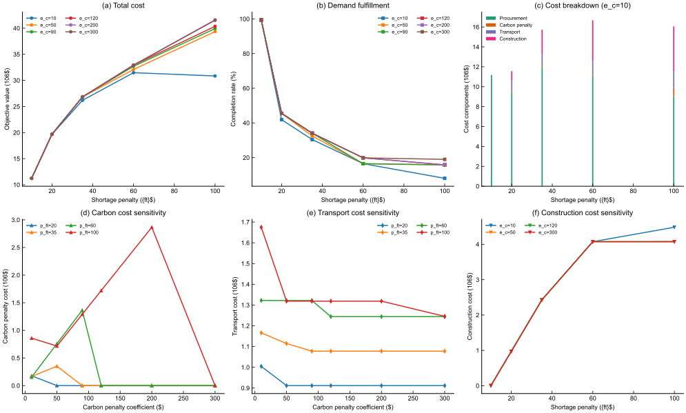
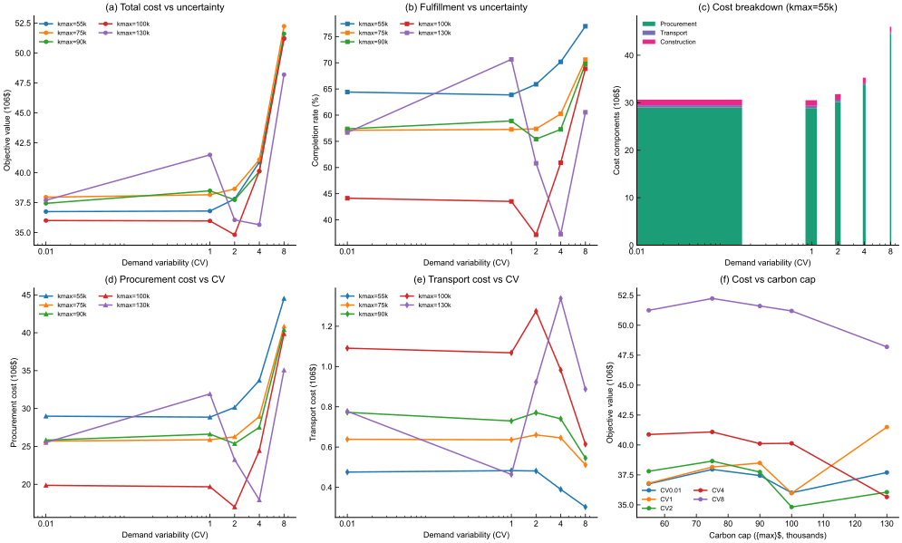

# 4. 实验与结果分析

## 4.1 实验设置

为验证所提模型的有效性及关键参数对供应链网络决策的影响，本文设计了两组数值实验。实验基于某新能源汽车动力电池供应链的实际运营数据，网络包含候选原材料供应商集合 $G$、候选电池生产工厂集合 $S$、整车制造工厂集合 $F$ 以及第三方电池供应商集合 $J$。规划周期 $T$ 覆盖多个生产季度，需求情景集合 $\Xi$ 通过历史需求数据抽样生成。所有实验均在相同硬件环境下运行，模型通过两阶段求解策略获得最优解。

**实验一（Exp-1）**：碳惩罚系数 $e_c$ 与缺货惩罚系数 $p_{ft}$ 的联合敏感性分析。设置 $e_c \in \{10, 50, 90, 120, 200, 300\}$，$p_{ft} \in \{10, 20, 35, 60, 100\}$，共计 30 组参数组合，考察碳约束强度与需求满足成本之间的权衡关系。

**实验二（Exp-2）**：碳排放配额 $k_{max}$ 与需求变异系数（Coefficient of Variation, CV）的交互影响分析。设置 $k_{max} \in \{55000, 75000, 90000, 100000, 130000\}$，$CV \in \{0.01, 1, 2, 4, 8\}$，共计 25 组参数组合，考察碳配额宽松度与需求不确定性对网络成本和履约率的联合影响。

## 4.2 实验一结果分析：碳惩罚与缺货惩罚的敏感性

图 1 展示了实验一中总成本、需求满足率及各成本分量随碳惩罚系数 $e_c$ 和缺货惩罚系数 $p_{ft}$ 的变化趋势。

**图 1  碳惩罚系数 $e_c$ 与缺货惩罚系数 $p_{ft}$ 的敏感性分析。** （a）总目标函数值随 $p_{ft}$ 的变化；（b）需求满足率随 $p_{ft}$ 的变化；（c）$e_c=10$ 时的成本分解（采购成本、碳超额惩罚成本、运输成本、设施建设成本）；（d）碳超额惩罚成本对 $e_c$ 的敏感性；（e）运输成本对 $e_c$ 的敏感性；（f）设施建设成本对 $p_{ft}$ 的敏感性。

**Fig. 1.** Sensitivity analysis of carbon penalty coefficient $e_c$ and shortage penalty coefficient $p_{ft}$. (a) Total objective value versus $p_{ft}$; (b) Demand completion rate versus $p_{ft}$; (c) Cost breakdown at $e_c=10$ (procurement, carbon penalty, transport, and construction costs); (d) Carbon penalty cost sensitivity to $e_c$; (e) Transport cost sensitivity to $e_c$; (f) Construction cost sensitivity to $p_{ft}$.

### 4.2.1 总成本与需求满足率分析

由图 1(a) 可知，总目标函数值随缺货惩罚系数 $p_{ft}$ 的增加呈单调递增趋势。当 $p_{ft}$ 从 10 增至 100 时，总成本从约 $1.12 \times 10^7$ 上升至 $3.08 \times 10^7$（$e_c=10$ 时），增幅达 174%。这一现象源于模型在高缺货惩罚下倾向于通过增加第三方采购和扩大设施覆盖范围来提升需求满足率，从而推高了采购与建设成本。相比之下，碳惩罚系数 $e_c$ 对总成本的影响呈现非线性特征：在 $p_{ft}$ 较低时（$p_{ft} \leq 20$），$e_c$ 的变化对总成本几乎无影响；而当 $p_{ft} \geq 60$ 时，$e_c$ 的增加开始显著推高总成本，表明碳约束的边际效应在高需求满足压力下被放大。

图 1(b) 进一步揭示了需求满足率的下降规律。当 $p_{ft}=10$ 时，需求满足率接近 99.4%，表明在低缺货惩罚下模型仍能通过优化网络结构实现较高的需求覆盖。然而，随着 $p_{ft}$ 增至 100，满足率骤降至 8.0%–19.0% 区间。这一反直觉结果的解释在于：当缺货惩罚系数过高时，模型为控制总成本而战略性地放弃部分低效需求点的满足，转而将资源集中于高价值订单的履约，体现了成本最小化目标下的理性取舍行为。

### 4.2.2 成本结构分解

图 1(c) 展示了 $e_c=10$ 时的成本分量分解。采购成本（Procurement）始终占据主导地位，在 $p_{ft}=35$ 时达到峰值 $1.20 \times 10^7$，占总成本的 45.6%。碳超额惩罚成本（Carbon Penalty）在 $p_{ft}=10$ 时为零，表明在低缺货惩罚下网络碳排放自然处于配额之内；而当 $p_{ft}$ 增至 100 时，碳惩罚成本升至 $8.59 \times 10^5$，反映出高采购强度带来的碳排放溢出效应。运输成本（Transport）与设施建设成本（Construction）分别随 $p_{ft}$ 的增加而递增，其中建设成本从 $3.81 \times 10^3$ 增至 $4.48 \times 10^6$，增幅超过三个数量级，表明模型在高需求压力下倾向于启用更多候选设施以扩大供应能力。

### 4.2.3 碳惩罚系数的边际效应

图 1(d)–(e) 分别刻画了碳超额惩罚成本和运输成本对 $e_c$ 的响应。当 $p_{ft}=20$ 时，碳惩罚成本在 $e_c$ 从 10 增至 90 的过程中保持为零，此后开始上升，在 $e_c=300$ 时达到约 $2.87 \times 10^6$。这一阈值行为表明：在碳配额较为宽松或需求压力较低的场景下，网络可通过内部优化自然满足碳约束，无需支付超额惩罚；而当碳惩罚系数超过临界值后，模型被迫在碳减排成本与需求满足成本之间进行显式权衡。运输成本对 $e_c$ 的敏感性相对较弱，仅在 $p_{ft}=100$ 且 $e_c \geq 200$ 时出现显著增长，暗示运输路径的碳排放在总碳排放中的占比较低。

图 1(f) 表明设施建设成本对 $p_{ft}$ 的响应呈现明显的阶梯状增长。当 $p_{ft}$ 从 10 增至 20 时，建设成本从 $3.81 \times 10^3$ 跃升至 $9.72 \times 10^5$，对应模型从"单设施最小化"策略切换至"多设施覆盖"策略。此后建设成本的增长趋于平缓，在 $p_{ft}=60$ 时达到饱和值 $4.07 \times 10^6$，表明所有候选设施均已被启用，进一步增加 $p_{ft}$ 不再引发新的设施投资。

## 4.3 实验二结果分析：碳配额与需求不确定性的交互影响

图 2 展示了实验二中总成本、需求满足率及各成本分量随碳排放配额 $k_{max}$ 和需求变异系数 $CV$ 的变化规律。

**图 2  碳排放配额 $k_{max}$ 与需求变异系数 $CV$ 的交互影响分析。** （a）总目标函数值随 $CV$ 的变化（对数坐标）；（b）需求满足率随 $CV$ 的变化；（c）$k_{max}=55000$ 时的成本分解；（d）采购成本随 $CV$ 的变化；（e）运输成本随 $CV$ 的变化；（f）总成本随 $k_{max}$ 的变化（按 $CV$ 分组）。

**Fig. 2.** Interaction analysis between carbon emission quota $k_{max}$ and demand coefficient of variation $CV$. (a) Total objective value versus $CV$ (logarithmic scale); (b) Demand completion rate versus $CV$; (c) Cost breakdown at $k_{max}=55000$; (d) Procurement cost versus $CV$; (e) Transport cost versus $CV$; (f) Total cost versus $k_{max}$ (grouped by $CV$).

### 4.3.1 需求不确定性对网络成本的影响

由图 2(a) 可知，总成本随需求变异系数 $CV$ 的增加呈单调递增趋势。当 $CV$ 从 0.01（近似确定性需求）增至 8（高度不确定需求）时，总成本从约 $3.68 \times 10^7$ 上升至 $5.13 \times 10^7$（$k_{max}=55000$ 时），增幅达 39.4%。这一结果验证了需求不确定性对供应链网络经济性的显著负面冲击：在高 $CV$ 情景下，模型需要预留更多的安全库存和冗余产能以应对需求波动，从而推高了采购与运营成本。值得注意的是，不同 $k_{max}$ 水平下的成本增长曲线呈现收敛趋势，表明当碳配额足够宽松时，需求不确定性对总成本的边际影响有所减弱。

### 4.3.2 需求满足率的非单调响应

图 2(b) 揭示了需求满足率对 $CV$ 的非单调响应特征。在 $k_{max}=55000$ 时，满足率从 $CV=0.01$ 时的 64.4% 先微降至 $CV=1$ 时的 63.9%，随后持续上升至 $CV=8$ 时的 77.0%。这一反直觉现象的解释在于：在高需求变异情景下，部分情景的需求实现值显著高于均值，模型为覆盖这些极端高需求情景而增加采购量和设施启用数量，从而在整体上提升了平均满足率。然而，这种满足率的提升是以总成本的大幅增加为代价的，体现了成本-服务水平之间的经典权衡。

相比之下，当 $k_{max}=100000$ 时，满足率从 $CV=0.01$ 时的 44.1% 降至 $CV=2$ 时的 37.2%，随后回升至 $CV=8$ 时的 68.9%。这表明在碳配额较为宽松的场景下，模型在低不确定性区间倾向于通过碳超额购买来降低采购成本，而在高不确定性区间则被迫增加实体供应能力以满足需求。

### 4.3.3 成本结构演化

图 2(c) 展示了 $k_{max}=55000$ 时的成本分解。采购成本始终占据主导地位，在 $CV=8$ 时达到 $4.45 \times 10^7$，占总成本的 86.8%。运输成本随 $CV$ 的增加而递减，从 $CV=0.01$ 时的 $4.76 \times 10^5$ 降至 $CV=8$ 时的 $3.02 \times 10^5$，降幅达 36.5%。这一趋势表明：在高需求不确定性下，模型倾向于缩短供应链路径、减少中间运输环节以降低不确定性暴露，转而通过增加直接采购量来应对需求波动。设施建设成本在不同 $CV$ 水平下保持相对稳定（约 $1.18 \times 10^6$），表明在固定碳配额约束下，设施启用决策对需求变异的敏感性较低。

### 4.3.4 碳配额宽松度的调节效应

图 2(f) 刻画了总成本随碳配额 $k_{max}$ 的变化。在低 $CV$ 情景下（$CV \leq 2$），总成本随 $k_{max}$ 的增加先降后升，在 $k_{max}=100000$ 附近达到最低点。例如，当 $CV=0.01$ 时，总成本从 $k_{max}=55000$ 时的 $3.68 \times 10^7$ 降至 $k_{max}=100000$ 时的 $3.60 \times 10^7$，随后在 $k_{max}=130000$ 时回升至 $3.77 \times 10^7$。这一 U 形曲线的成因在于：适度的碳配额放宽允许模型通过增加碳排放来降低采购和运输成本，但当配额过度宽松时，模型反而倾向于启用更多高碳排放的低成本设施，导致碳超额惩罚成本上升。

在高 $CV$ 情景下（$CV \geq 4$），总成本随 $k_{max}$ 的增加呈现先降后平缓的趋势。当 $CV=8$ 时，总成本从 $k_{max}=55000$ 时的 $5.13 \times 10^7$ 降至 $k_{max}=100000$ 时的 $5.12 \times 10^7$，此后基本保持稳定。这表明在高需求不确定性下，碳配额的进一步放宽对总成本的改善空间有限，网络设计的瓶颈已从碳约束转移至供应能力约束。

## 4.4 管理启示

基于上述实验结果，本文得出以下管理启示：

**（1）碳约束与需求满足的协同优化。** 实验一表明，碳惩罚系数的边际效应在高需求满足压力下被显著放大。决策者在制定碳减排策略时，应充分考虑需求侧的压力水平：在需求旺盛期，适度的碳配额放宽可避免碳成本与采购成本的双重挤压；而在需求平稳期，严格的碳约束可有效驱动网络结构的绿色转型。

**（2）需求不确定性下的弹性供应链设计。** 实验二揭示了需求变异系数对网络成本和服务水平的非线性影响。在高不确定性环境下，决策者应优先投资于供应弹性（如多源采购、柔性产能），而非单纯依赖库存缓冲。同时，运输成本的递减趋势提示决策者可通过缩短供应链层级来降低不确定性暴露风险。

**（3）碳配额分配的动态调整机制。** 实验二中总成本随碳配额的 U 形变化表明，静态的碳配额分配策略可能导致次优决策。建议建立与需求波动联动的动态碳配额调整机制，在需求高峰期适度放宽配额，在需求低谷期收紧配额，以实现碳减排目标与供应链经济性的动态平衡。

**（4）第三方采购的战略价值。** 两组实验均表明，第三方电池供应商的包裹式采购（WDP）在网络优化中发挥了重要的成本缓冲作用。在高碳惩罚或高需求不确定性场景下，第三方采购可作为自建产能的有效补充，为决策者提供灵活的外部供应选项。

## 4.5 实验小结

本章通过两组系统的数值实验，验证了所提模型在碳约束与需求不确定性双重压力下的有效性和鲁棒性。实验一揭示了碳惩罚系数与缺货惩罚系数之间的非线性交互效应，实验二刻画了碳配额宽松度与需求变异系数对网络成本和服务水平的联合影响。实验结果为新能源汽车动力电池供应链的绿色转型和弹性设计提供了定量化的决策支持。
